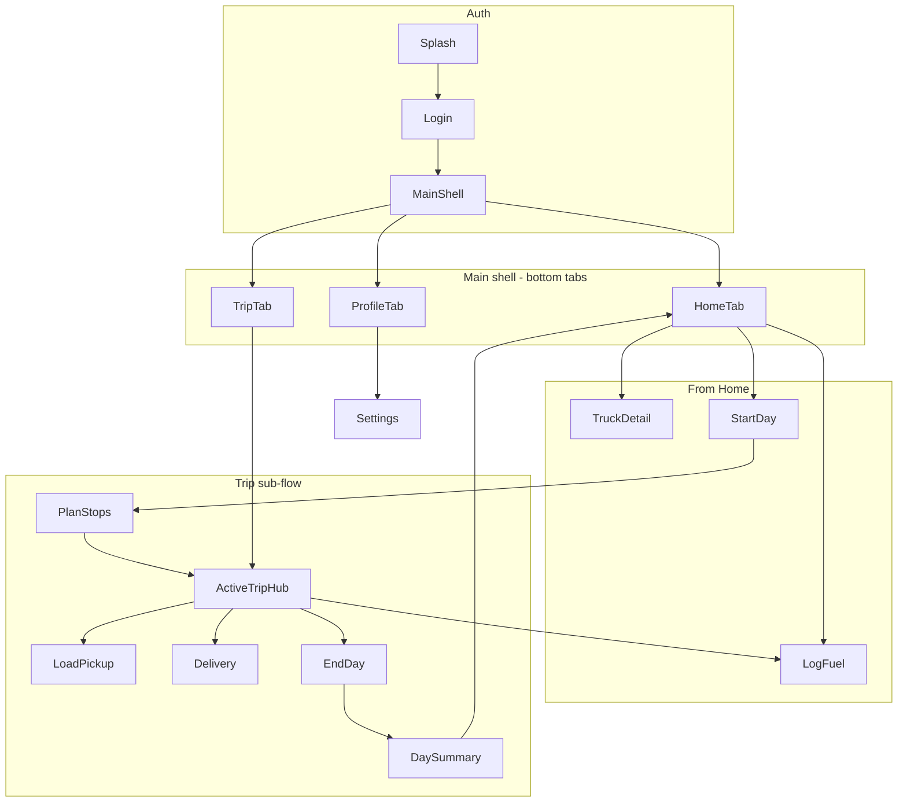
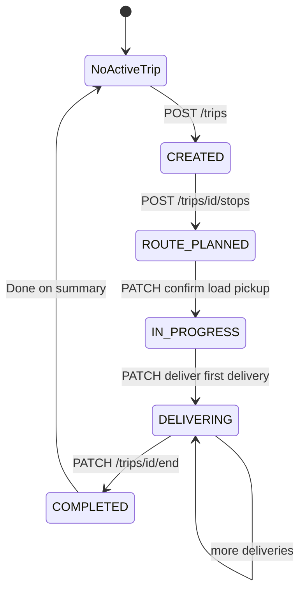

# Trucky Italia — Android Driver App UI/UX Plan

UI/UX specification for the **Android Driver App**, mapped to [fleet-tracker-api/docs/API_INTEGRATION.md](../fleet-tracker-api/docs/API_INTEGRATION.md) and [fleet-tracker-api/README.md](../fleet-tracker-api/README.md).

**Scope:** Driver-only app (`DRIVER` role). Admin features live in the React dashboard.

**Backend:** REST at `/api` + Socket.IO at `/ws` (path `/ws`, auth via `token` in handshake).

---

## App goal

Let a driver complete one work day end-to-end: sign in → confirm truck → start trip → plan stops → stream GPS → confirm pickup → complete deliveries → log fuel → end day → view summary.

---

## Navigation overview



### Bottom navigation (logged-in)

| Tab | Default screen | Notes |
|-----|----------------|-------|
| **Home** | Driver dashboard | Greeting, truck card, primary CTA |
| **Trip** | Active Trip Hub *or* Start Day prompt | Greyed if no truck assigned |
| **Profile** | Profile | Link to Settings |

Trip sub-screens (Start Day → Plan Stops → Pickup/Delivery → End Day) use a **nested stack** so back navigation is predictable.

---

## Trip state machine (drives UI)

Backend `TripStatus` order: `CREATED` → `ROUTE_PLANNED` → `IN_PROGRESS` → `DELIVERING` → `COMPLETED`



**Note:** There is no driver `GET /trips` endpoint. Persist active `tripId`, stops, and status **locally** after each API success so the app survives restarts.

---

## Screen catalog

### 1. Splash

| Item | Detail |
|------|--------|
| **Purpose** | Session bootstrap |
| **API** | `POST /api/auth/refresh` if refresh token stored |
| **UI** | Branded logo, loading indicator |
| **Routes** | Valid session → Main shell; else → Login |
| **Errors** | `INVALID_TOKEN` → clear storage → Login |

---

### 2. Login

| Item | Detail |
|------|--------|
| **API** | `POST /api/auth/login` |
| **Fields** | Email, password (show/hide toggle) |
| **Actions** | Sign in (primary, full-width) |
| **Success** | Store tokens + user; fetch `GET /api/drivers/me`; go to Main shell |
| **Errors** | `INVALID_CREDENTIALS` → inline message under form |
| **UX** | Disable button while loading; keyboard-friendly layout |

---

### 3. Home (Driver dashboard)

| Item | Detail |
|------|--------|
| **API** | `GET /api/drivers/me`, `GET /api/trucks/assigned` |
| **Header** | "Good morning/afternoon, {name}" |
| **Truck card** | Registration, trailer, status badge (`ACTIVE` / `IDLE` / `OFFLINE` / `MAINTENANCE`) |
| **Primary CTA** | No active trip → **Start Day**; active trip → **Continue Trip** |
| **Secondary** | View truck details; Log fuel (only if trip active) |
| **Empty: no truck** | Blocking card: *Contact your fleet manager* (404/403 on assigned truck) |
| **Warning** | `MAINTENANCE` status → banner before allowing Start Day |
| **Banner** | Offline: *No connection — GPS positions queued* (when local queue non-empty) |

---

### 4. Profile

| Item | Detail |
|------|--------|
| **API** | `GET /api/drivers/me` (refresh on open) |
| **Display** | Name, email, license number, phone, assigned truck number |
| **Actions** | Open Settings; **Log out** (clear tokens, stop GPS, disconnect socket) |

---

### 5. Settings

| Item | Detail |
|------|--------|
| **API** | None |
| **Display** | App version, environment label (local / staging / prod) |
| **Actions** | Log out |
| **Note** | No server settings endpoint — build-time config only |

---

### 6. Truck detail

| Item | Detail |
|------|--------|
| **API** | `GET /api/trucks/assigned` |
| **Display** | Registration number, trailer number, status |
| **UX** | Read-only; back to Home |
| **Empty** | Same as Home no-truck state |

---

### 7. Start day

| Item | Detail |
|------|--------|
| **API** | `POST /api/trips` |
| **Fields** | Truck number (read-only), trailer number, starting place, starting km, start time (default now) |
| **Validation** | Required fields; numeric km |
| **Success** | Save trip locally; emit WS `TRIP_STARTED`; navigate → Plan stops |
| **Errors** | `ACTIVE_TRIP_EXISTS` (409) → redirect to Active Trip Hub; `TRUCK_NOT_ASSIGNED` (403) → error sheet |

**Request body (API):**
```json
{
  "truckNumber": "MI-234AB",
  "trailerNumber": "TRL-001",
  "startingPlace": "Milan Hub",
  "startingKm": 10500,
  "startTime": "2024-06-05T08:00:00.000Z"
}
```

---

### 8. Plan stops

| Item | Detail |
|------|--------|
| **API** | `POST /api/trips/:id/stops` |
| **List** | Ordered stops with sequence, type badge, location name |
| **Add stop** | Type (`LOAD_PICKUP` \| `DELIVERY`), location name, lat/lon via "Use current location" or manual |
| **Reorder** | Drag to update `sequence` |
| **Guidance** | Recommend ≥1 pickup + ≥1 delivery before submit |
| **Success** | Status → `ROUTE_PLANNED`; start GPS foreground service; navigate → Active Trip Hub |

**Stop types (UI labels):**
- `LOAD_PICKUP` → "Load pickup"
- `DELIVERY` → "Delivery"

---

### 9. Active trip hub (core in-trip screen)

| Item | Detail |
|------|--------|
| **API (background)** | `POST /api/tracking/location` or WS `GPS_UPDATE`; batch sync on reconnect |
| **Status chip** | `ROUTE_PLANNED` / `IN_PROGRESS` / `DELIVERING` |
| **Progress** | "{completed} / {total} stops" |
| **Next stop card** | Name, type, **Navigate** (Google Maps intent with lat/lon) |
| **Primary action** | Pending `LOAD_PICKUP` → Confirm pickup; pending `DELIVERY` → Complete delivery |
| **Secondary** | Log fuel, End day |
| **End day rule** | Disabled until all stops done, or confirm dialog if incomplete |
| **GPS indicator** | Streaming / Queued offline / No permission |
| **Background** | Foreground service + persistent notification; tap opens this screen |

---

### 10. Confirm load pickup

| Item | Detail |
|------|--------|
| **API** | `PATCH /api/trips/:id/stops/:stopId/confirm` |
| **Auto-fill** | GPS lat, lon, accuracy, timestamp (now) |
| **Input** | Km reading (odometer) |
| **UX** | Large confirm button; show coordinates / accuracy |
| **Success** | Update local stop → `CONFIRMED`; emit WS `STOP_COMPLETED`; back to Active Trip Hub |

---

### 11. Complete delivery

| Item | Detail |
|------|--------|
| **API** | `PATCH /api/trips/:id/stops/:stopId/deliver` |
| **Fields** | Place (pre-filled), km reading, labour charges (optional €), notes, timestamp |
| **UX** | Numeric keyboard for km/charges; multiline notes |
| **Success** | Stop → `COMPLETED`; emit WS `STOP_COMPLETED`; back to Active Trip Hub |

---

### 12. Log fuel

| Item | Detail |
|------|--------|
| **API** | `POST /api/fuel` |
| **Entry from** | Active Trip Hub, Home (when trip active) |
| **Fields** | Type toggle (`DIESEL` \| `ADBLUE`), litres, price/L (show computed total), km reading, location, timestamp |
| **Requires** | Active `tripId` |
| **Success** | Snackbar confirmation; server may raise LOW alert if fill-up unusually high |

---

### 13. End day

| Item | Detail |
|------|--------|
| **API** | `PATCH /api/trips/:id/end` |
| **Fields** | Ending km (must be ≥ starting km) |
| **Errors** | `INVALID_KM` → inline under field |
| **Success** | Stop GPS service; disconnect socket; clear local trip; navigate → Day summary |

---

### 14. Day summary

| Item | Detail |
|------|--------|
| **Data source** | Response from end-trip API (cache — no extra call) |
| **Display** | Date, driver, truck, start/end km, total km, working hours, delivery count, fuel summary |
| **Action** | **Done** → Home |
| **Optional v2** | Share screenshot (no driver PDF endpoint) |

---

## System UI (not full screens)

| Element | Behavior |
|---------|----------|
| **GPS notification** | "Trucky — tracking active" + truck; tap → Active Trip Hub |
| **Location permission** | Rationale before request; foreground + background for tracking |
| **Notification permission** | Android 13+ for foreground service |
| **Offline banner** | Top of Home / Active Trip Hub when GPS queue pending |
| **Error bottom sheet** | Reusable: `FORBIDDEN`, `TRUCK_NOT_ASSIGNED`, `TRIP_NOT_AUTHORIZED`, network errors |

---

## API ↔ screen matrix (driver only)

| Screen | REST | WebSocket emit |
|--------|------|----------------|
| Splash | `POST /auth/refresh` | — |
| Login | `POST /auth/login` | — |
| Home, Profile | `GET /drivers/me` | — |
| Truck detail | `GET /trucks/assigned` | — |
| Start day | `POST /trips` | `TRIP_STARTED` |
| Plan stops | `POST /trips/:id/stops` | — |
| Active trip / GPS | `POST /tracking/location`, `POST /tracking/location/batch` | `GPS_UPDATE` |
| Load pickup | `PATCH .../stops/:stopId/confirm` | `STOP_COMPLETED` |
| Delivery | `PATCH .../stops/:stopId/deliver` | `STOP_COMPLETED` |
| Log fuel | `POST /fuel` | — |
| End day | `PATCH /trips/:id/end` | — |
| Idle (background) | — | `IDLE_ALERT` |

**Not in Android UI:** users, trucks CRUD, trips list/detail/route, alerts list, dashboard, reports.

---

## Background behavior (UX impact)

| Behavior | Detail |
|----------|--------|
| **GPS interval** | Every 10–30 s during active trip; timestamp ≤ 60 s old for single POST |
| **Transport** | Prefer WS `GPS_UPDATE` + ACK; fallback REST |
| **Offline** | Queue in local DB; `POST /tracking/location/batch` on reconnect (max 500) |
| **Idle** | Optional: stationary ~30 min → WS `IDLE_ALERT` + subtle driver warning |
| **Token refresh** | On 401 or ~2 min before 15 min expiry via `POST /auth/refresh` |

---

## Enums for UI copy and badges

| Enum | Values | UI use |
|------|--------|--------|
| `TruckStatus` | ACTIVE, IDLE, OFFLINE, MAINTENANCE | Truck card badge color |
| `TripStatus` | CREATED, ROUTE_PLANNED, IN_PROGRESS, DELIVERING, COMPLETED | Status chip on Active Trip Hub |
| `StopType` | LOAD_PICKUP, DELIVERY | Stop list icons / labels |
| `StopStatus` | PENDING, CONFIRMED, COMPLETED | Progress checkmarks |
| `FuelEntryType` | DIESEL, ADBLUE | Fuel form toggle |

---

## Phase 2 placeholders (do not wire to API yet)

Backend scaffolds only — show disabled UI or hide behind feature flag:

| Screen | Planned API |
|--------|-------------|
| SOS emergency | `POST /api/sos` |
| Proof of delivery | `/api/pod/*` (signature + photo) |
| Geofence awareness | `/api/geofences/*` |

---

## UX principles

1. **Large touch targets** — minimal typing while on the road.
2. **One clear next action** on Active Trip Hub (pickup or delivery).
3. **Never block on network** for GPS — queue silently, show subtle offline state.
4. **Odometer at every milestone** — start, pickup, delivery, fuel, end day.
5. **Pre-fill** truck, trip, place, and timestamps wherever the API allows.

---

## Error codes → user messages

| Code | HTTP | Suggested message |
|------|------|-------------------|
| `INVALID_CREDENTIALS` | 401 | Wrong email or password |
| `INVALID_TOKEN` | 401 | Session expired — sign in again |
| `TRUCK_NOT_ASSIGNED` | 403 | This truck is not assigned to you |
| `ACTIVE_TRIP_EXISTS` | 409 | You already have an active trip |
| `INVALID_KM` | 400 | Ending km must be at least starting km |
| `STALE_TIMESTAMP` | 400 | GPS data too old — retrying |
| `DRIVER_NOT_FOUND` | 404 | Driver profile not found — contact support |

---

## Manual test flow (seed data)

Credentials: `driver1@truckyitalia.com` / `Driver1234!` — truck `MI-234AB`

1. Login → assigned truck on Home  
2. Start day → add 1 pickup + 2 deliveries → GPS notification appears  
3. Confirm pickup → complete deliveries → log diesel + AdBlue  
4. End day → view summary  
5. Airplane mode mid-trip → reconnect → batch sync  
6. Try second start while trip active → `ACTIVE_TRIP_EXISTS` handling  

---

## References

- [API Integration Guide](../fleet-tracker-api/docs/API_INTEGRATION.md)
- [API README](../fleet-tracker-api/README.md)
- Swagger: `http://localhost:3000/api/docs` (local)
