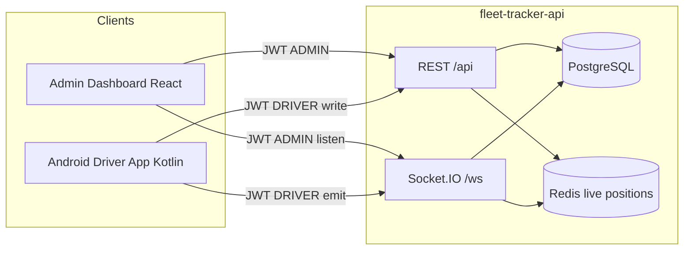
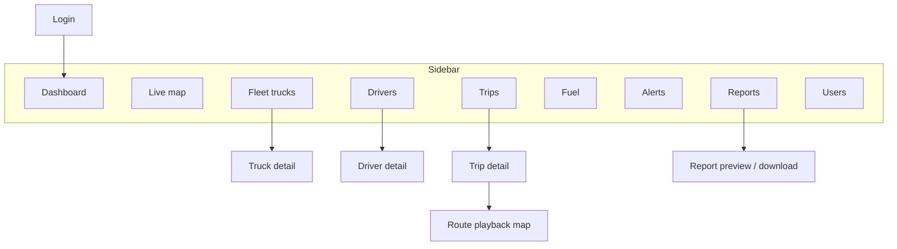
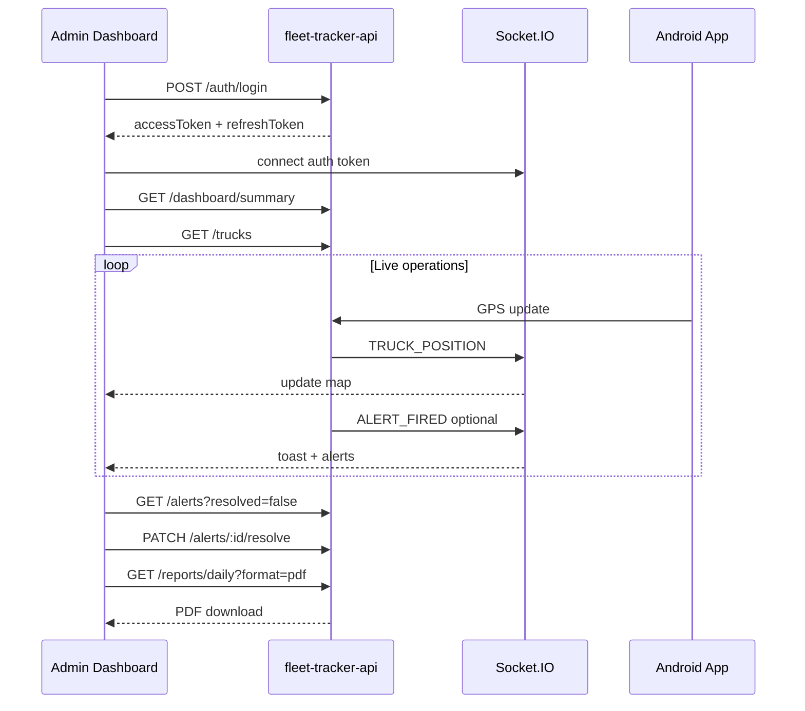

# Trucky Italia — Admin Dashboard Plan

UI/UX and integration plan for the **Admin Dashboard** web application, mapped to [fleet-tracker-api/docs/API_INTEGRATION.md](../fleet-tracker-api/docs/API_INTEGRATION.md) and [fleet-tracker-api/README.md](../fleet-tracker-api/README.md).

**Scope:** Fleet operations for `SUPER_ADMIN` and `FLEET_MANAGER` (treated as **ADMIN** in the API). Driver workflows stay in the [Android Driver App](../trucky-driver-app/PLAN.md).

**Stack (per backend docs):** React SPA, REST + Socket.IO.

---

## How the three systems work together

The admin dashboard and Android driver app **never talk to each other directly**. Both use the same NestJS backend as the single source of truth.



### Division of responsibility

| Concern | Admin dashboard | Android driver app | Backend |
|---------|-----------------|-------------------|---------|
| Create users / drivers | Yes | No | Persists |
| Assign trucks to drivers | Yes | No | Persists |
| Start trip, stops, deliveries | View only | Yes | Persists |
| Send GPS | No | Yes | Redis + DB |
| View live map | Yes (WebSocket) | Own position only | Broadcasts |
| Alerts | List, resolve | Triggers only (speed, idle, fuel) | Creates + stores |
| Reports & exports | Yes (PDF/CSV) | No | Generates |
| Fuel entry | View / KPIs | POST entries | Persists |

### Typical real-time flow (driver → admin)

1. Driver app sends `GPS_UPDATE` (WebSocket) or `POST /api/tracking/location` (REST).
2. Backend stores position, updates Redis live state, may fire overspeed alert.
3. Backend emits `TRUCK_POSITION` to the `admin` WebSocket room.
4. Dashboard live map updates truck marker without polling.
5. If alert fires, backend emits `ALERT_FIRED` → dashboard toast + alerts panel refresh.

### Typical admin flow (admin → driver)

1. Admin creates driver via `POST /api/users` (role `DRIVER`).
2. Admin registers truck via `POST /api/trucks`.
3. Admin assigns truck via `POST /api/drivers/:id/assign-truck`.
4. Driver logs in on Android, sees assigned truck on Home — **no direct notification from dashboard**; driver pulls `/api/trucks/assigned`.

---

## Authentication and session

| Item | Detail |
|------|--------|
| **Login** | `POST /api/auth/login` with admin email/password |
| **Roles** | `SUPER_ADMIN`, `FLEET_MANAGER` — same API access |
| **Tokens** | `accessToken` (15 min), `refreshToken` (30 days) |
| **Refresh** | `POST /api/auth/refresh` on 401 or proactively before expiry |
| **Storage** | `httpOnly` cookie (preferred) or `sessionStorage` + refresh rotation |
| **Guard** | Redirect unauthenticated users to Login; reject `DRIVER` role with forbidden page |

**Seed logins (dev):**

| Role | Email | Password |
|------|-------|----------|
| Super Admin | admin@truckyitalia.com | Admin1234! |
| Fleet Manager | manager@truckyitalia.com | Manager1234! |

---

## WebSocket integration (admin)

| Setting | Value |
|---------|-------|
| URL | Same host as API |
| Path | `/ws` |
| Auth | `auth: { token: accessToken }` on connect |
| Room | Server joins ADMIN clients to `admin` |

### Events to listen (server → dashboard)

| Event | Use in UI |
|-------|-----------|
| `TRUCK_POSITION` | Live map marker updates (lat, lon, speed, heading, lastUpdate) |
| `ALERT_FIRED` | Toast + increment badge; refresh alerts list |
| `SOS_TRIGGERED` | Critical banner + sound (Phase 2 when SOS API live) |
| `TRUCK_OFFLINE` | Mark truck offline on map / fleet list |
| `TRUCK_IDLE` | Optional toast; link to truck detail |
| `TRIP_UPDATED` | Refresh trip detail / active trips if open |

### Events admin does **not** emit

GPS and trip lifecycle events are **driver-only** (`GPS_UPDATE`, `TRIP_STARTED`, `STOP_COMPLETED`, `IDLE_ALERT`).

### Connection UX

- Connect after successful login; disconnect on logout.
- Show connection status chip in app header: Connected / Reconnecting / Offline.
- On reconnect, refetch `GET /api/trucks` and `GET /api/alerts?resolved=false` to reconcile state.

---

## Navigation structure

**Layout:** Persistent sidebar + top bar (user menu, alerts bell, WebSocket status).



### Sidebar items

| Nav item | Primary API | Real-time |
|----------|-------------|-----------|
| Dashboard | `GET /dashboard/summary` | Optional poll or WS-driven widget refresh |
| Live map | `GET /trucks` + initial live positions | `TRUCK_POSITION` |
| Fleet | `GET /trucks` | `TRUCK_POSITION`, `TRUCK_OFFLINE` |
| Drivers | `GET /drivers` | — |
| Trips | `GET /trips` | `TRIP_UPDATED` |
| Fuel | `GET /fuel`, `GET /fuel/kpis` | — |
| Alerts | `GET /alerts` | `ALERT_FIRED`, `SOS_TRIGGERED`, `TRUCK_IDLE` |
| Reports | `GET /reports/*` | — |
| Users | `GET /users` | — |

---

## Screen catalog

### 1. Login

| Item | Detail |
|------|--------|
| **API** | `POST /api/auth/login` |
| **Fields** | Email, password |
| **Success** | Store tokens; connect WebSocket; redirect → Dashboard |
| **Errors** | `INVALID_CREDENTIALS` inline |
| **Block** | Users with `role: DRIVER` → "This portal is for fleet managers only" |

---

### 2. Dashboard (home)

| Item | Detail |
|------|--------|
| **API** | `GET /api/dashboard/summary` |
| **Widgets** | Total trucks, active / idle / offline counts, today km, month km, active alerts, fuel alerts |
| **Quick links** | Live map, unresolved alerts, today's trips |
| **Refresh** | On mount + every 60s or when `ALERT_FIRED` / `TRIP_UPDATED` received |
| **Empty** | Zero trucks → CTA to Fleet → Add truck |

**Summary response fields:**

```json
{
  "totalTrucks": 6,
  "activeTrucks": 2,
  "idleTrucks": 1,
  "offlineTrucks": 3,
  "todayFleetKm": 450.5,
  "monthFleetKm": 12500.0,
  "activeAlerts": 3,
  "fuelAlerts": 1
}
```

---

### 3. Live map

| Item | Detail |
|------|--------|
| **API (initial)** | `GET /api/trucks`; per visible truck `GET /api/trucks/:id/live` for Redis snapshot |
| **Real-time** | `TRUCK_POSITION` updates markers; `TRUCK_OFFLINE` greys out |
| **Marker popup** | Truck number, speed, last update, status badge, link to Truck detail |
| **Filters** | Status: ACTIVE, IDLE, OFFLINE, MAINTENANCE |
| **UX** | Full-width map (Mapbox / Google Maps / Leaflet); fit bounds to fleet |

---

### 4. Fleet list (trucks)

| Item | Detail |
|------|--------|
| **API** | `GET /api/trucks` |
| **Table columns** | Registration, trailer, status, assigned driver (if relation returned), last update |
| **Actions** | Add truck, open detail, change status |
| **Add truck** | Modal → `POST /api/trucks` `{ registrationNumber, trailerNumber? }` |
| **Status quick action** | `PATCH /api/trucks/:id/status` `{ status }` |

**Truck status badges:** `ACTIVE` | `IDLE` | `OFFLINE` | `MAINTENANCE`

---

### 5. Truck detail

| Item | Detail |
|------|--------|
| **API** | `GET /api/trucks/:id`, `GET /api/trucks/:id/live`, `GET /api/trucks/:id/trips` |
| **Sections** | Info card, live position mini-map, trip history table (paginated) |
| **Edit** | `PATCH /api/trucks/:id` — registration, trailer, status |
| **Live position** | Poll `/live` every 30s **or** rely on `TRUCK_POSITION` when truck id matches |
| **Trip history filters** | `startDate`, `endDate`, `page`, `limit` |

---

### 6. Drivers list

| Item | Detail |
|------|--------|
| **API** | `GET /api/drivers` |
| **Table columns** | Name, phone, license, assigned truck, status |
| **Actions** | Open detail, assign truck |
| **Create driver** | Shortcut to Users → Create with role `DRIVER` |

---

### 7. Driver detail

| Item | Detail |
|------|--------|
| **API** | `GET /api/drivers/:id`, `GET /api/drivers/:id/trips`, `PATCH /api/drivers/:id`, `POST /api/drivers/:id/assign-truck` |
| **Sections** | Profile, assigned truck, trip history |
| **Edit profile** | `PATCH` — name, licenseNumber, phone |
| **Assign truck** | Dropdown of trucks → `POST assign-truck` `{ truckId }` |
| **Trip history** | Same query params as truck trips |

---

### 8. Trips list

| Item | Detail |
|------|--------|
| **API** | `GET /api/trips` |
| **Filters** | driverId, truckId, status, startDate, endDate |
| **Table columns** | Date, driver, truck, status, total km, delivery count |
| **Pagination** | `page`, `limit`, `meta.total` |
| **Row action** | Open Trip detail |
| **Status filter chips** | CREATED, ROUTE_PLANNED, IN_PROGRESS, DELIVERING, COMPLETED |

---

### 9. Trip detail

| Item | Detail |
|------|--------|
| **API** | `GET /api/trips/:id` |
| **Sections** | Summary (start/end km, hours), stops timeline, load pickups, delivery records |
| **Stop timeline** | Sequence, type (`LOAD_PICKUP` / `DELIVERY`), location, status (`PENDING` / `CONFIRMED` / `COMPLETED`) |
| **Actions** | View route playback |
| **Real-time** | `TRIP_UPDATED` refreshes status when detail page open |

---

### 10. Route playback

| Item | Detail |
|------|--------|
| **API** | `GET /api/trips/:id/route` |
| **UI** | Map polyline from GPS points; optional scrubber by timestamp |
| **Point data** | lat, lon, speed, heading, timestamp |
| **UX** | Open from Trip detail; show speed color gradient optional |

---

### 11. Fuel

| Item | Detail |
|------|--------|
| **API** | `GET /api/fuel`, `GET /api/fuel/kpis` |
| **KPI cards** | Total litres, total cost, L/100km, AdBlue totals and rate |
| **Table** | Entries with type, driver, truck, litres, cost, location, timestamp |
| **Filters** | truckId, driverId, type (DIESEL/ADBLUE), date range |
| **Note** | Entries created by drivers via Android `POST /api/fuel` |

---

### 12. Alerts

| Item | Detail |
|------|--------|
| **API** | `GET /api/alerts`, `PATCH /api/alerts/:id/resolve` |
| **Default sort** | Unresolved first, then newest |
| **Filters** | type, severity, resolved, truckId, date range |
| **Table columns** | Type, severity, truck, driver, message, time, resolved |
| **Actions** | Resolve (PATCH), link to truck on map |
| **Real-time** | `ALERT_FIRED` prepends row; bell badge count |
| **Severity styling** | CRITICAL/HIGH = red; MEDIUM = amber; LOW/INFO = neutral |

**Alert types:** SOS, OFFLINE, OVERSPEED, IDLE, LOW_FUEL, LOW_ADBLUE, GEOFENCE_ENTRY, GEOFENCE_EXIT

---

### 13. Reports

| Item | Detail |
|------|--------|
| **API** | See reports table below |
| **UX** | Report type picker → date/month range → filters (driver, truck) → format (JSON preview / PDF / CSV download) |

| Report | Path | Required params |
|--------|------|-----------------|
| Daily | `GET /api/reports/daily` | `date` (YYYY-MM-DD) |
| Monthly | `GET /api/reports/monthly` | `month` (YYYY-MM) |
| Custom range | `GET /api/reports/custom` | `startDate`, `endDate` |
| Fuel | `GET /api/reports/fuel` | `startDate`, `endDate` |
| Trips | `GET /api/reports/trips` | `startDate`, `endDate` |

- `format=json` → preview in UI with `{ success, data }`
- `format=pdf` | `format=csv` → browser file download (no JSON wrapper)

**Daily report fields:** date, driverName, truckNumber, totalKm, workingHours, deliveryCount, fuelLitres, fuelCost, adblueLitres, adblueCost, stops[]

---

### 14. Users management

| Item | Detail |
|------|--------|
| **API** | `GET /api/users`, `POST /api/users`, `PATCH /api/users/:id` |
| **Table** | Email, role, active status |
| **Create user** | Form: email, password, role |
| **Create driver** | When role = `DRIVER`, require driverName, licenseNumber, phone |
| **Edit** | `PATCH` — email, role, isActive |
| **Roles** | SUPER_ADMIN, FLEET_MANAGER, DRIVER |

---

### 15. System UI (global)

| Element | Behavior |
|---------|----------|
| **Top bar alerts bell** | Unresolved count; dropdown last 5; link to Alerts page |
| **WebSocket status** | Connected / Reconnecting indicator |
| **Toast notifications** | `ALERT_FIRED`, `SOS_TRIGGERED` (critical) |
| **403 / 401 handler** | Refresh token once; else logout |
| **Error boundary** | Friendly message + retry for API failures |

---

## API ↔ screen matrix (admin only)

| Screen | REST | WebSocket listen |
|--------|------|------------------|
| Login | `POST /auth/login` | Connect after login |
| Session | `POST /auth/refresh` | — |
| Dashboard | `GET /dashboard/summary` | Optional: react to alert/trip events |
| Live map | `GET /trucks`, `GET /trucks/:id/live` | `TRUCK_POSITION`, `TRUCK_OFFLINE` |
| Fleet | `GET /trucks`, `POST /trucks`, `PATCH /trucks/:id`, `PATCH /trucks/:id/status` | `TRUCK_POSITION` |
| Truck detail | `GET /trucks/:id`, `GET /trucks/:id/live`, `GET /trucks/:id/trips` | `TRUCK_POSITION` |
| Drivers | `GET /drivers` | — |
| Driver detail | `GET /drivers/:id`, `PATCH /drivers/:id`, `POST /drivers/:id/assign-truck`, `GET /drivers/:id/trips` | — |
| Trips list | `GET /trips` | `TRIP_UPDATED` |
| Trip detail | `GET /trips/:id` | `TRIP_UPDATED` |
| Route playback | `GET /trips/:id/route` | — |
| Fuel | `GET /fuel`, `GET /fuel/kpis` | — |
| Alerts | `GET /alerts`, `PATCH /alerts/:id/resolve` | `ALERT_FIRED`, `SOS_TRIGGERED`, `TRUCK_IDLE` |
| Reports | `GET /reports/*` | — |
| Users | `GET /users`, `POST /users`, `PATCH /users/:id` | — |

**Not used by admin (driver-only):** `POST /trips`, stops confirm/deliver, `POST /tracking/*`, `POST /fuel`, `GET /drivers/me`, `GET /trucks/assigned`.

---

## Admin session flow (typical day)



---

## Recommended frontend architecture

```
trucky-admin-dashboard/
  src/
    api/           # Axios/fetch client, auth interceptor, response wrapper types
    ws/            # Socket.IO singleton, event hooks
    features/
      auth/
      dashboard/
      map/
      fleet/
      drivers/
      trips/
      fuel/
      alerts/
      reports/
      users/
    components/    # Shared table, filters, status badges, map
    layouts/       # SidebarLayout, AuthLayout
    routes/        # React Router
```

**Suggested libraries:** React 18+, TypeScript, React Router, TanStack Query (caching + refetch), Socket.IO client, a map library, UI kit (MUI / shadcn), date picker for report filters.

---

## Enums for UI

| Enum | Values | UI use |
|------|--------|--------|
| `UserRole` | SUPER_ADMIN, FLEET_MANAGER, DRIVER | Users table; hide DRIVER portal link |
| `TruckStatus` | ACTIVE, IDLE, OFFLINE, MAINTENANCE | Fleet badges, map legend |
| `TripStatus` | CREATED → … → COMPLETED | Trips filter and detail chip |
| `StopType` | LOAD_PICKUP, DELIVERY | Trip timeline icons |
| `StopStatus` | PENDING, CONFIRMED, COMPLETED | Timeline checkmarks |
| `FuelEntryType` | DIESEL, ADBLUE | Fuel table filter |
| `AlertType` | SOS, OFFLINE, OVERSPEED, … | Alerts filter and icons |
| `AlertSeverity` | CRITICAL … INFO | Row color, toast priority |

---

## Phase 2 placeholders (backend not ready)

Do not integrate until APIs are implemented:

| Feature | Planned API | Dashboard UI |
|---------|-------------|--------------|
| SOS monitoring | `POST /api/sos` (driver) | Critical alert type + map pin (partially via `SOS_TRIGGERED` WS today) |
| Proof of delivery | `/api/pod/*` | Trip detail: signature + photo viewer |
| Geofences | `/api/geofences/*` | Map overlay editor + entry/exit alerts |

---

## UX principles for fleet managers

1. **Live map is the operational hub** — default landing alternative to Dashboard for dispatchers.
2. **Alerts demand attention** — unresolved CRITICAL/HIGH at top; one-click resolve.
3. **Drill-down everywhere** — truck on map → truck detail → trips → route playback.
4. **No polling for positions** — rely on WebSocket; REST `/live` only for initial load or reconnect.
5. **Reports are export-first** — PDF/CSV for accounting; JSON for in-app preview only.
6. **Data density over decoration** — tables with filters beat card-only layouts for fleet scale.

---

## Error handling

| Code | HTTP | Dashboard action |
|------|------|------------------|
| `INVALID_CREDENTIALS` | 401 | Login form error |
| `INVALID_TOKEN` / `UNAUTHORIZED` | 401 | Try refresh; else logout |
| `FORBIDDEN` | 403 | Toast: insufficient permissions |
| `ALERT_NOT_FOUND` | 404 | Remove stale row from alerts table |
| Network error | — | Retry button; keep WS reconnecting |

---

## Implementation phases

### Phase 1 — MVP
Login, Dashboard, Fleet list + detail, Drivers list + assign truck, Trips list + detail, Alerts list + resolve, WebSocket live map.

### Phase 2 — Operations
Route playback, Fuel page + KPIs, Users CRUD, Reports with PDF/CSV download, global alert toasts.

### Phase 3 — Polish
Dashboard auto-refresh on WS events, advanced filters, role-based UI (if SUPER_ADMIN vs FLEET_MANAGER diverge later), Italian/English i18n.

### Phase 4 — Backend Phase 2
Geofence editor, POD viewer, enhanced SOS workflow.

---

## Manual test checklist (seed data)

1. Login as `manager@truckyitalia.com` → Dashboard widgets load.
2. Fleet → see `MI-234AB`, `MI-567CD`; assign driver if needed.
3. Live map → start driver app trip → marker moves on `TRUCK_POSITION`.
4. Trips → filter by status; open completed trip → route playback.
5. Alerts → trigger overspeed or idle from driver → appears via `ALERT_FIRED` → resolve.
6. Fuel → see entries after driver logs fuel on Android.
7. Reports → daily PDF for today downloads.
8. Users → create new driver with license + phone.

---

## References

- [API Integration Guide](../fleet-tracker-api/docs/API_INTEGRATION.md)
- [API README](../fleet-tracker-api/README.md)
- [Android Driver App Plan](../trucky-driver-app/PLAN.md)
- Swagger: `http://localhost:3000/api/docs` (local)
